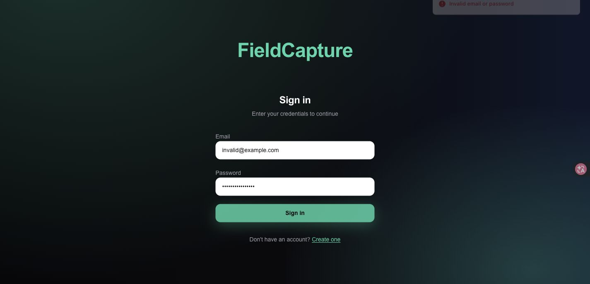

# [Login Restyling Bootstrap] Task 8 - Test Edge Cases & Log Bugs

| Role | Dev Tester - Kai Jie Yee | Date | Thursday, 13 August 2026 |
| --- | --- | --- | --- |

## Completion Comment

**Done:** Tested invalid login, direct team-page URL access without login, missing-photo member fallback, and current deployed blurb layout. No blocking bugs found.

**Deliverable:** Edge case test report.

**Note for next role:** PM - everything passed, nothing outstanding for Dev 1 to fix before your review.

**Git URL (test script):** <https://github.com/PierreTZY/RMIT-Capstone-Programming-Project-Group-48-Team-B-mock-sprint-for-Task-2-Login-Restyling/blob/main/sprint-docs/test-script-edge-cases.js>

## Evidence

## Edge Case Results

| ID | Edge Case | Actual Result | Status |
| --- | --- | --- | --- |
| EC-01 | Invalid login | Invalid credentials showed `Invalid email or password` and remained on the sign-in page. | Pass |
| EC-02 | Direct `/team` access without login | Logged-out access redirected to `/auth/signin?redirect=%2Fteam`. | Pass |
| EC-03 | Missing profile photo fallback | Member cards displayed avatar/default icons. | Pass |
| EC-04 | Long blurb / grid overflow check | Current deployed blurbs displayed within cards without visible overflow or grid break. | Pass |
| EC-05 | Bug logging | No blocking bugs found. | Pass |

## Bugs

N/A - no blocking bugs found during edge-case testing.
